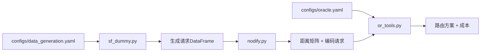

# Agentic AI - Green Agent for Ride-Hailing Dispatch Evaluation

> Evaluating dynamic ride-hailing dispatch with natural language requests

---

## 📁 代码库结构总览

```
Agentic-AI/
├── configs/                    # 配置文件目录
│   ├── data_generation.yaml    # 数据生成参数
│   ├── oracle.yaml            # OR-Tools求解器参数
│   └── mdp_env.yaml           # (未使用，可能是未来的MDP环境配置)
│
├── src/
│   ├── data_gen/              # 数据生成模块
│   │   ├── sf_dummy.py        # 生成虚拟打车请求
│   │   ├── nodify.py          # 网络编码（H3→距离矩阵）
│   │   └── sf_h3_indices_res7.csv  # 缓存的SF区域H3索引
│   │
│   ├── solver/                # 路由求解模块
│   │   ├── or_tools.py        # OR-Tools DARP求解器
│   │   └── __main__.py        # 可执行入口
│   │
│   └── google_map/            # 外部API模块
│       └── gmap.py            # Google Maps API查询距离
│
└── Agentic-AI Green Agent Proposal (1).md  # 设计文档
```

---

## 🔍 核心模块详解

### 1️⃣ 数据生成模块 (`src/data_gen/`)

#### **`sf_dummy.py`** - 请求生成器

**功能：** 生成符合真实统计分布的虚拟打车请求

**输入：** 配置参数（来自 `configs/data_generation.yaml`）
```yaml
N_min: 10                     # 最少生成请求数
N_max: 15                     # 最多生成请求数
resolution: 7                 # H3分辨率（~0.66 km²）
temporal_interval_minutes: 30 # 时间窗口30分钟
vehicle_speed_kmh: 20         # 车速20 km/h
min_distance_h3_units: 3      # 最小行程距离
```

**输出：** DataFrame + H3索引列表
```python
requests = pd.DataFrame([
    {
        'origin': '872830828ffffff',      # 起点H3索引
        'destination': '872830829ffffff',  # 终点H3索引
        'o_t_index': 12,                  # 起点时间索引(05:00-06:00)
        'd_t_index': 14                   # 终点时间索引(06:00-07:00)
    },
    ...
])
```

**关键特性：**
- 使用2D高斯分布在SF中心生成pickup/dropoff位置
- 基于距离和车速计算合理的时间窗口
- 缓存H3索引避免重复计算

---

#### **`nodify.py`** - 网络编码器

**功能：** 将H3地理索引转换为OR-Tools可用的数值网络

**输入：** 请求DataFrame（H3格式）

**输出：** 网络表示字典
```python
{
    "map": {0: 'depot_h3', 1: 'loc1_h3', 2: 'loc2_h3', ...},  # 空间ID→H3映射
    "distance": [[0, 2.5, 4.1], [2.5, 0, 3.2], ...],          # 距离矩阵(km)
    "requests": [
        {'origin': 1, 'destination': 3, 'o_t_index': 12, 'd_t_index': 14},
        ...
    ],
    "depot": 'depot_h3_index'  # 车队基地位置
}
```

**关键功能：**
- 提取所有唯一的pickup/dropoff位置
- 添加depot位置作为索引0
- 计算所有位置对之间的地理距离（使用geodesic）
- 将H3索引转换为数值ID供求解器使用

---

### 2️⃣ 求解器模块 (`src/solver/`)

#### **`or_tools.py`** - DARP路由优化

**功能：** 使用Google OR-Tools求解Dial-a-Ride Problem（打车调度问题）

**输入：**
```python
cost_estimator(
    distance_matrix,    # 距离矩阵(km)
    requests,           # 请求列表
    vehicle_num=8,      # 车辆数量
    depot_node=0,       # 车队基地索引
    vehicle_speed=20.0, # 车速(km/h)
    time_window=30,     # 时间窗口(分钟)
    capacity=10,        # 车辆容量
    max_solve_time=0.1  # 最大求解时间(秒)
)
```

**输出：**
```python
{
    "status": "FEASIBLE",           # 求解状态
    "total_distance_km": 45.3,      # 总行驶距离
    "routing_cost": 45.3,           # 路由成本(=总距离)
    "total_cost": 45.3,             # 总成本
    "num_vehicles_used": 5,         # 实际使用车辆数
    "solve_time": 0.08,             # 求解用时(秒)
    "routes": [                     # 每辆车的路线
        [1, 3, 2, 4],               # 车辆1: pickup1→dropoff1→pickup2→dropoff2
        [5, 7, 6, 8],               # 车辆2: ...
        ...
    ]
}
```

**核心约束：**
- ✅ **Pickup-Delivery配对**：同一请求的pickup和dropoff必须由同一车辆完成
- ✅ **时间窗口**：必须在指定时间范围内到达pickup/dropoff位置
- ✅ **车辆容量**：同时服务的乘客数≤车辆容量
- ✅ **时间一致性**：pickup必须在dropoff之前

**求解策略：**
- 首次解：Parallel Cheapest Insertion（并行最便宜插入）
- 优化：Guided Local Search（引导式局部搜索）

---

### 3️⃣ 外部API模块 (`src/google_map/`)

#### **`gmap.py`** - Google Maps查询

**功能：** 查询两点间的实际驾驶时间

**用法：**
```bash
python gmap.py "Golden Gate Park, SF" "SFO Airport"
# 输出: "23 mins"
```

**注意：** 代码中硬编码了API key（生产环境应该用环境变量）

---

## 🎯 当前代码的工作流程



**执行示例：**
```bash
python -m src.solver  # 运行完整流程
```

**输出：**
```
25  # 生成了25个请求
{
 'num_vehicles': 8,
 'num_vehicles_used': 7,
 'routing_cost': 156.78,
 'routes': [[1, 3, 5, 7], [2, 4], ...],
 'solve_time': 0.09,
 'status': 'FEASIBLE',
 'total_cost': 156.78,
 'total_distance_km': 156.78
}
```

---

## ⚠️ 当前代码库缺失的部分（Demo需要补充）

1. **Green Agent评估逻辑** - 如何评分White Agent的输出
2. **White Agent接口定义** - White Agent应该如何接收请求并返回结果
3. **自然语言请求生成** - 目前只有结构化数据，没有NL版本
4. **可视化界面** - 展示地图、路线、评分
5. **司机状态管理** - 动态更新司机位置和可用性

---

## 📝 项目目标

根据设计文档，本项目的目标是构建一个**Green Agent评估环境**，用于测试和评估不同的**White Agent**（打车调度算法）在以下方面的性能：

1. **自然语言解析准确度** - White Agent能否正确理解自然语言请求
2. **路由效率** - 调度方案的总距离、响应时间等指标
3. **鲁棒性** - 在高峰期、不均匀需求分布等场景下的表现

---

## 🚀 快速开始

### 安装依赖
```bash
pip install pandas numpy h3 geopy scipy ortools googlemaps pyyaml
```

### 运行示例
```bash
# 生成请求并求解路由
python -m src.solver

# 查询Google Maps距离
python src/google_map/gmap.py "起点地址" "终点地址"
```

---

## 📅 开发时间线

- **10/8 - 10/20**: Demo准备和MVP实现
- **10/20 - 11/3**: 完整Green Agent实现和文档
- **11/9**: Top 3 Green Agent公布
- **11/17 - 12/12**: 竞赛White Agent实现（如果入选）

---

## 📚 参考文献

- [Urban Routing Benchmark for RL](https://arxiv.org/abs/2505.17734)
- [DARP Request Dataset in NYC](https://arxiv.org/pdf/2305.18859)
