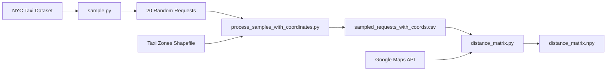
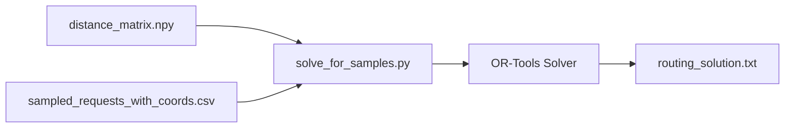
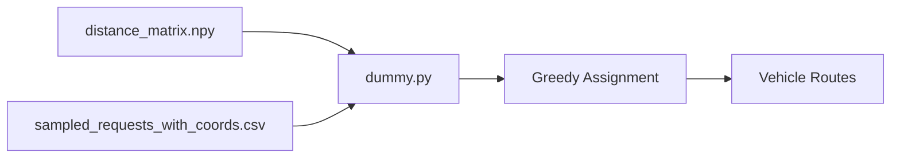
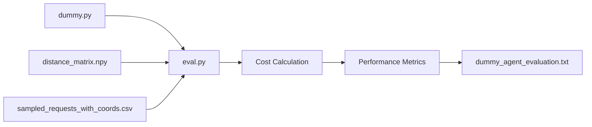

# Agentic AI - Green Agent for Ride-Hailing Dispatch Evaluation

> Evaluating dynamic ride-hailing dispatch with natural language requests

---

## 📁 代码库结构总览

```
Agentic-AI/
├── configs/                    # 配置文件目录
│   ├── data_generation.yaml    # 数据生成参数
│   ├── oracle.yaml            # OR-Tools求解器参数
│   └── mdp_env.yaml           # (未使用，可能是未来的MDP环境配置)
│
├── dataset/                    # 数据集目录
│   ├── records/               # NYC出租车记录
│   │   └── green_tripdata_2025-01.parquet
│   └── taxi_zones/            # NYC出租车区域shapefile
│       └── taxi_zones.shp (+ related files)
│
├── src/
│   ├── data_sampling/         # 数据采样与处理模块
│   │   ├── sample.py          # 从NYC数据集采样请求
│   │   ├── process_samples_with_coordinates.py  # 添加坐标和时间窗口
│   │   ├── distance_matrix.py # 生成travel time矩阵
│   │   ├── sampled_requests_with_coords.csv    # 采样的20个请求
│   │   ├── distance_matrix.npy                 # 41x41 travel time矩阵
│   │   ├── distance_matrix.json                # 矩阵JSON格式
│   │   ├── routing_solution.txt                # OR-Tools求解结果
│   │   └── dummy_agent_evaluation.txt          # Dummy Agent评估结果
│   │
│   ├── solver/                # 路由求解模块
│   │   ├── or_tools.py        # OR-Tools DARP求解器
│   │   ├── solve_for_samples.py  # 对采样数据求解路由
│   │   └── __main__.py        # 可执行入口
│   │
│   ├── white_agent/           # White Agent模块（被评估对象）
│   │   └── dummy.py           # Dummy贪心调度算法
│   │
│   ├── green_agent/           # Green Agent模块（评估器）
│   │   └── eval.py            # 评估White Agent性能
│   │
│   └── google_map/            # 外部API模块
│       └── gmap.py            # Google Maps API查询距离
│
└── Agentic-AI Green Agent Proposal (1).md  # 设计文档
```

---

## 🔍 核心模块详解

### 1️⃣ 数据生成模块 (`src/data_gen/`)

#### **`sf_dummy.py`** - 请求生成器

**功能：** 生成符合真实统计分布的虚拟打车请求

**输入：** 配置参数（来自 `configs/data_generation.yaml`）
```yaml
N_min: 10                     # 最少生成请求数
N_max: 15                     # 最多生成请求数
resolution: 7                 # H3分辨率（~0.66 km²）
temporal_interval_minutes: 30 # 时间窗口30分钟
vehicle_speed_kmh: 20         # 车速20 km/h
min_distance_h3_units: 3      # 最小行程距离
```

**输出：** DataFrame + H3索引列表
```python
requests = pd.DataFrame([
    {
        'origin': '872830828ffffff',      # 起点H3索引
        'destination': '872830829ffffff',  # 终点H3索引
        'o_t_index': 12,                  # 起点时间索引(05:00-06:00)
        'd_t_index': 14                   # 终点时间索引(06:00-07:00)
    },
    ...
])
```

**关键特性：**
- 使用2D高斯分布在SF中心生成pickup/dropoff位置
- 基于距离和车速计算合理的时间窗口
- 缓存H3索引避免重复计算

---

#### **`nodify.py`** - 网络编码器

**功能：** 将H3地理索引转换为OR-Tools可用的数值网络

**输入：** 请求DataFrame（H3格式）

**输出：** 网络表示字典
```python
{
    "map": {0: 'depot_h3', 1: 'loc1_h3', 2: 'loc2_h3', ...},  # 空间ID→H3映射
    "distance": [[0, 2.5, 4.1], [2.5, 0, 3.2], ...],          # 距离矩阵(km)
    "requests": [
        {'origin': 1, 'destination': 3, 'o_t_index': 12, 'd_t_index': 14},
        ...
    ],
    "depot": 'depot_h3_index'  # 车队基地位置
}
```

**关键功能：**
- 提取所有唯一的pickup/dropoff位置
- 添加depot位置作为索引0
- 计算所有位置对之间的地理距离（使用geodesic）
- 将H3索引转换为数值ID供求解器使用

---

### 2️⃣ 求解器模块 (`src/solver/`)

#### **`or_tools.py`** - DARP路由优化

**功能：** 使用Google OR-Tools求解Dial-a-Ride Problem（打车调度问题）

**输入：**
```python
cost_estimator(
    distance_matrix,    # 距离矩阵(km)
    requests,           # 请求列表
    vehicle_num=8,      # 车辆数量
    depot_node=0,       # 车队基地索引
    vehicle_speed=20.0, # 车速(km/h)
    time_window=30,     # 时间窗口(分钟)
    capacity=10,        # 车辆容量
    max_solve_time=0.1  # 最大求解时间(秒)
)
```

**输出：**
```python
{
    "status": "FEASIBLE",           # 求解状态
    "total_distance_km": 45.3,      # 总行驶距离
    "routing_cost": 45.3,           # 路由成本(=总距离)
    "total_cost": 45.3,             # 总成本
    "num_vehicles_used": 5,         # 实际使用车辆数
    "solve_time": 0.08,             # 求解用时(秒)
    "routes": [                     # 每辆车的路线
        [1, 3, 2, 4],               # 车辆1: pickup1→dropoff1→pickup2→dropoff2
        [5, 7, 6, 8],               # 车辆2: ...
        ...
    ]
}
```

**核心约束：**
- ✅ **Pickup-Delivery配对**：同一请求的pickup和dropoff必须由同一车辆完成
- ✅ **时间窗口**：必须在指定时间范围内到达pickup/dropoff位置
- ✅ **车辆容量**：同时服务的乘客数≤车辆容量
- ✅ **时间一致性**：pickup必须在dropoff之前

**求解策略：**
- 首次解：Parallel Cheapest Insertion（并行最便宜插入）
- 优化：Guided Local Search（引导式局部搜索）

---

### 3️⃣ 外部API模块 (`src/google_map/`)

#### **`gmap.py`** - Google Maps查询

**功能：** 查询两点间的实际驾驶时间

**用法：**
```bash
python gmap.py "Golden Gate Park, SF" "SFO Airport"
# 输出: "23 mins"
```

**注意：** 代码中硬编码了API key（生产环境应该用环境变量）

---

## 🎯 完整工作流程

### Phase 1: 数据采样与预处理



**Step 1: 采样请求**
```bash
cd dataset
python process_samples_with_coordinates.py
```

**输出：**
- `sampled_requests_with_coords.csv` - 包含20个请求，每个请求有：
  - `pickup_loc`: (纬度, 经度)
  - `dropoff_loc`: (纬度, 经度)
  - `pickup_time_window`: [start_timestamp, end_timestamp] (±5分钟)
  - `dropoff_time_window`: [start_timestamp, end_timestamp] (±5分钟)
  - `pickup_idx`: 原始LocationID (pickup)
  - `dropoff_idx`: 原始LocationID (dropoff)

**Step 2: 生成距离矩阵**
```bash
cd src/data_sampling
python distance_matrix.py
```

**输出：**
- `distance_matrix.npy` - 41×41矩阵，表示节点间travel time（分钟）
- `distance_matrix.json` - JSON格式，包含节点信息

**节点编码规则：**
- Node 0: Depot（所有请求的平均经纬度）
- Node 2k-1: Request k的pickup节点 (k=1,2,...,20)
- Node 2k: Request k的dropoff节点

---

### Phase 2: 求解最优路由（OR-Tools）



**执行：**
```bash
cd src/solver
python solve_for_samples.py
```

**输出示例：**
```
Status: FEASIBLE
Total Cost: 475.64 minutes
Vehicles Used: 7

routes: {
  vehicle_1: [4],
  vehicle_2: [10, 5, 6, 16, 17],
  vehicle_3: [2, 3, 18, 9, 19, 15, 12, 20],
  vehicle_4: [8, 11],
  vehicle_5: [7],
  vehicle_6: [1],
  vehicle_7: [14, 13],
}
```

---

### Phase 3: Dummy Agent调度



**执行：**
```bash
cd src/white_agent
python dummy.py
```

**Dummy Agent算法：**
1. 初始化10辆车，所有车在depot（node 0）
2. 按顺序处理每个请求
3. 对每个请求：
   - 检查所有车辆的可行性（基于时间窗口和travel time）
   - 从可行车辆中随机选择一辆
   - 更新该车辆的位置和可用时间
4. 输出每辆车分配到的请求列表

**输出示例：**
```
Total Requests: 20
Assigned: 19
Unassigned: 1
Vehicles Used: 9

routes: {
  vehicle_1: [2, 14, 20],
  vehicle_2: [1, 9, 15],
  vehicle_3: [6, 16],
  vehicle_4: [4],
  vehicle_5: [3, 5, 17],
  vehicle_6: [11, 13],
  vehicle_8: [12],
  vehicle_9: [8],
  vehicle_10: [10, 18, 19],
}

Unassigned Requests: [7]
```

---

### Phase 4: Green Agent评估



**执行：**
```bash
cd src/green_agent
python eval.py
```

**评估指标：**
1. **Total Routing Cost** - 所有车辆的总travel time（分钟）
2. **Assignment Rate** - 成功分配的请求比例
3. **Vehicles Used** - 实际使用的车辆数量
4. **Cost per Vehicle** - 每辆车的路由成本明细
5. **Gap vs Optimal** - 与OR-Tools最优解的差距

**输出示例：**
```
Total Routing Cost: 670.17 minutes
Assigned Requests: 19/20 (95%)
Vehicles Used: 9

Vehicle Breakdown:
  Vehicle 1: [2, 14, 20] → 114.52 min
  Vehicle 2: [1, 9, 15] → 98.83 min
  ...

--- Comparison with OR-Tools ---
Dummy Agent Cost: 670.17 minutes
OR-Tools Cost: 475.64 minutes
Gap: +40.90%
```

---

## ✅ 已实现功能

1. ✅ **数据采样** - 从真实NYC taxi数据集采样请求
2. ✅ **坐标计算** - 基于taxi zones shapefile计算区域中心点
3. ✅ **距离矩阵生成** - 使用Google Maps API获取实际travel time
4. ✅ **OR-Tools求解器** - 提供最优baseline方案
5. ✅ **Dummy Agent** - 简单的贪心调度算法示例
6. ✅ **Green Agent评估** - 计算routing cost并与最优解对比

## 🔧 待补充功能（未来改进方向）

1. **自然语言请求生成** - 目前只有结构化数据，没有NL版本
2. **可视化界面** - 展示地图、路线、评分
3. **动态调度** - 实时处理新请求的能力
4. **多种评估指标** - 除了routing cost，还可以评估响应时间、公平性等
5. **LLM-based White Agent** - 使用LLM直接理解请求并生成调度方案

---

## 📝 项目目标

根据设计文档，本项目的目标是构建一个**Green Agent评估环境**，用于测试和评估不同的**White Agent**（打车调度算法）在以下方面的性能：

1. **自然语言解析准确度** - White Agent能否正确理解自然语言请求
2. **路由效率** - 调度方案的总距离、响应时间等指标
3. **鲁棒性** - 在高峰期、不均匀需求分布等场景下的表现

---

## 🚀 快速开始

### 安装依赖
```bash
pip install pandas numpy h3 geopy scipy ortools googlemaps pyyaml geopandas
```

### 完整运行流程

#### 1. 数据准备（仅需运行一次）
```bash
# Step 1: 从NYC数据集采样20个请求并添加坐标
cd dataset
python process_samples_with_coordinates.py

# Step 2: 生成travel time矩阵（需要Google Maps API）
cd ../src/data_sampling
python distance_matrix.py
```

**注意：** `distance_matrix.py`会调用Google Maps API，可能需要几分钟并消耗API配额。

#### 2. 运行OR-Tools最优求解器（Baseline）
```bash
cd ../solver
python solve_for_samples.py
```

**输出：** `src/data_sampling/routing_solution.txt`
- 最优路由方案
- 最小化总travel time

#### 3. 运行Dummy Agent（被评估对象）
```bash
cd ../white_agent
python dummy.py
```

**输出：** `src/data_sampling/dummy_agent_solution.txt`
- 贪心算法的路由方案
- 可能有未分配的请求

#### 4. 运行Green Agent评估
```bash
cd ../green_agent
python eval.py
```

**输出：** `src/data_sampling/dummy_agent_evaluation.txt`
- Dummy Agent的routing cost
- 与OR-Tools的对比
- 详细的每辆车成本breakdown

### 一键运行完整流程
```bash
# 从项目根目录执行
cd src/solver && python solve_for_samples.py
cd ../white_agent && python dummy.py
cd ../green_agent && python eval.py
```

---

## 📊 实验结果对比

### 测试场景
- **数据集**: NYC Green Taxi (2025-01)
- **请求数量**: 20个随机采样请求
- **车辆数量**: 10辆
- **节点数**: 41 (1 depot + 40 pickup/dropoff nodes)
- **时间窗口**: 实际时间 ±5分钟

### 性能对比

| 指标 | OR-Tools (最优) | Dummy Agent (贪心) | 差距 |
|------|----------------|-------------------|------|
| **Total Cost** | 475.64 min | 670.17 min | +40.90% |
| **Vehicles Used** | 7 | 9 | +28.57% |
| **Requests Assigned** | 20/20 (100%) | 19/20 (95%) | -5% |
| **Solve Time** | ~30 sec | <1 sec | - |

### 关键发现

1. **OR-Tools优势**:
   - 找到全局最优解或接近最优解
   - 100%请求分配率
   - 更少的车辆使用量
   - 更短的总travel time

2. **Dummy Agent特点**:
   - 极快的响应时间（适合实时场景）
   - 简单易实现
   - 但有40%的效率损失
   - 可能无法分配所有请求

3. **改进方向**:
   - 考虑全局优化而非贪心选择
   - 动态调整时间窗口
   - 使用机器学习预测最优分配

---

## 📅 开发时间线

- **10/8 - 10/20**: Demo准备和MVP实现
- **10/20 - 11/3**: 完整Green Agent实现和文档
- **11/9**: Top 3 Green Agent公布
- **11/17 - 12/12**: 竞赛White Agent实现（如果入选）

---

## 📚 参考文献

- [Urban Routing Benchmark for RL](https://arxiv.org/abs/2505.17734)
- [DARP Request Dataset in NYC](https://arxiv.org/pdf/2305.18859)
